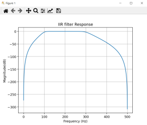

# IIR-and-FIR-Filters

It was designed for visualistion of Graphs of IIR and FIR Filters using `Python` `Numpy` `matplotlib` `scipy` and `PyQt5`

## Sample Output:

  
  
IIR Filter at Fs=1000, N=5, Fc=100,300

  
  
FIR Filter at Fs=1000, N=20, Fc=100

